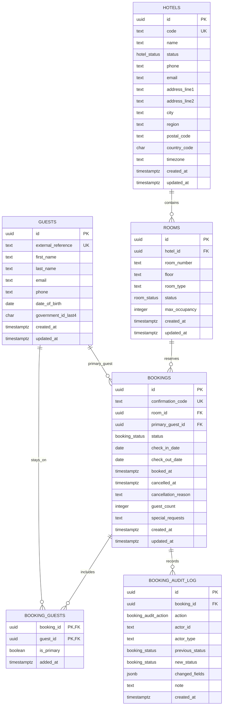

# Hotel booking relational schema

This repository contains a PostgreSQL relational schema and ERD for hotels, physical rooms, guests, bookings, and booking audit history.

## Entity relationship diagram

## Constraint summary

- `hotels.code` is unique; rooms are scoped to hotels with `rooms.hotel_id -> hotels.id`.
- `(hotel_id, room_number)` is unique so each physical room is identified once per hotel.
- `bookings.room_id -> rooms.id` and `bookings.primary_guest_id -> guests.id` are required foreign keys.
- `booking_guests` is a required join table for all staying guests with FKs to `bookings` and `guests`.
- `booking_guests_one_primary_per_booking` allows only one primary guest marker per booking.
- `bookings_confirmation_code_unique` guarantees globally unique confirmation codes.
- `bookings_date_order` enforces `check_in_date < check_out_date`.
- `bookings_active_room_date_no_overlap` is a PostgreSQL GiST exclusion constraint over `daterange(check_in_date, check_out_date, '[)')`; it prevents overlapping `confirmed` or `checked_in` bookings for the same physical room while allowing cancelled/no-show/pending rows to remain in history.
- `booking_audit_log` is append-only by convention and captures lifecycle action, actor, previous/new status, JSON field-level changes, notes, and timestamp.
- `created_at`/`updated_at` columns exist on mutable tables, with triggers maintaining `updated_at`.

See [`schema.sql`](./schema.sql) for the executable PostgreSQL DDL.
