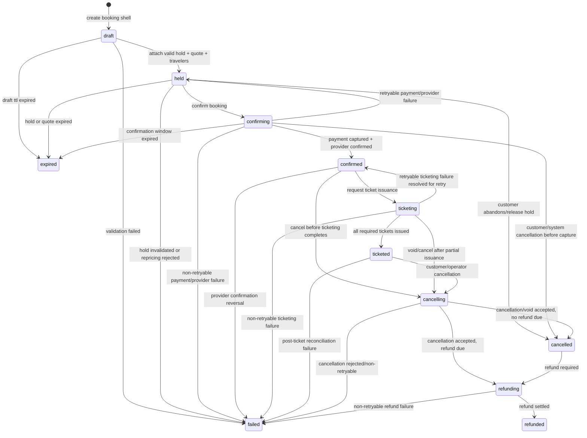
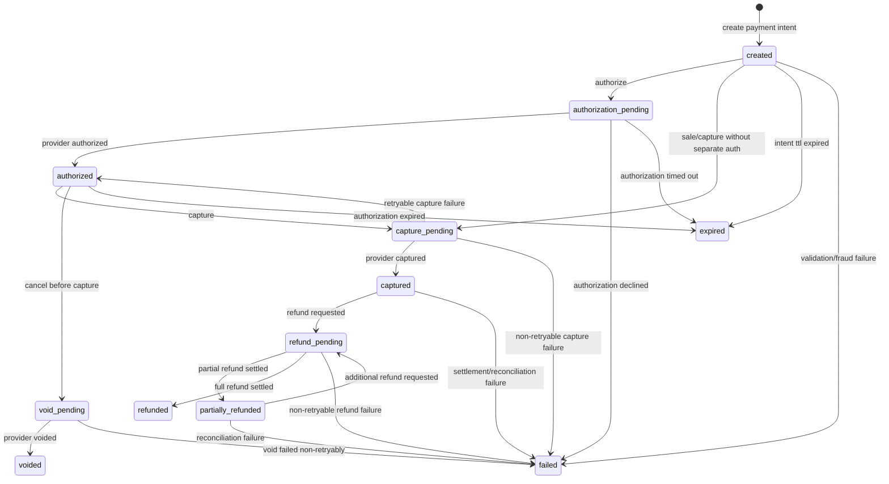

# Canonical booking lifecycle state model

This document defines the canonical lifecycle states for booking orchestration and the related passenger, itinerary, payment, ticket, and cancellation sub-lifecycles. These states are the shared contract for APIs, domain events, read models, and support tooling.

## Principles

1. Each aggregate has one canonical state value and an append-only transition history.
2. State transitions are command- or event-driven and MUST be validated by the owning service before persistence.
3. Terminal states are immutable except where an explicit post-terminal financial state is modeled, such as a cancelled booking moving to `refunded` after money movement completes.
4. Failure states preserve the failed dependency, provider code, retryability, and last attempted transition.
5. Expiration is system-driven and uses the earliest expiring dependency, such as inventory hold, quote, or payment authorization.
6. Booking is the customer-facing orchestration state; payment, ticket, passenger, itinerary, and cancellation states remain independently queryable for diagnostics and reconciliation.

## Booking lifecycle

### State definitions

| State | Terminal | Description |
| --- | --- | --- |
| `draft` | No | Booking shell exists while traveler, itinerary, price quote, and contact data are being assembled. |
| `held` | No | Inventory hold and price quote are attached; booking can be confirmed before hold/quote expiry. |
| `confirming` | No | Confirmation command accepted; booking is authorizing/capturing payment and reserving provider order details. |
| `confirmed` | No | Payment is successful and provider order/PNR is confirmed; ticketing may start. |
| `ticketing` | No | Ticket issuance is in progress for one or more passengers/segments. |
| `ticketed` | No | Required tickets or travel documents are issued for all ticketable passengers/segments. |
| `cancelling` | No | Cancellation request is accepted and booking is coordinating ticket void/exchange and refund eligibility. |
| `cancelled` | No | Travel service obligation is cancelled or voided; refund may still be pending or not applicable. |
| `refunding` | No | Refund command is accepted by payment and is pending provider settlement or reconciliation. |
| `refunded` | Yes | Required refund is completed or all refundable balances are reconciled to zero. |
| `expired` | Yes | Booking can no longer proceed because the hold, quote, authorization, or confirmation window expired. |
| `failed` | Yes | Booking cannot proceed because a non-retryable validation, provider, payment, or ticketing failure occurred. |

### State transition diagram

### Transition rules

| From | To | Trigger | Preconditions | Side effects/events |
| --- | --- | --- | --- | --- |
| `draft` | `held` | `CreateBooking` or `AttachHold` succeeds | Traveler snapshot is valid; inventory hold and price quote are active; itinerary checksum matches quote. | Persist itinerary/passenger snapshots; emit `booking.created`. |
| `draft` | `failed` | Validation fails | Missing required passenger/contact/itinerary data or unsupported fare rules. | Store validation errors; emit `booking.failed`. |
| `draft` | `expired` | Draft TTL elapses | No active confirmation attempt. | Release any provisional resources; emit `booking.expired`. |
| `held` | `confirming` | `ConfirmBooking` accepted | Hold and quote have not expired; idempotency key is valid; no active cancellation. | Lock booking for confirmation; request payment authorization/capture. |
| `held` | `expired` | Hold or quote expiry watcher fires | Current time is after hold/quote expiry and confirmation has not started. | Release hold; emit `booking.expired`. |
| `held` | `cancelled` | Customer abandons or releases hold | Payment has not been captured and no provider order is confirmed. | Release hold; emit `booking.cancelled`. |
| `held` | `failed` | Hold invalidated or repricing rejected | Provider reports unavailable inventory or unacceptable price change. | Store provider/pricing failure; emit `booking.failed`. |
| `confirming` | `confirmed` | Payment captured and provider order confirmed | Captured amount equals accepted quote; provider confirmation/PNR exists. | Emit `booking.confirmed`; request ticketing if required. |
| `confirming` | `held` | Retryable dependency failure | Hold/quote remain active and payment did not capture or was voided. | Record retry attempt; expose retryable error. |
| `confirming` | `failed` | Non-retryable payment/provider failure | Payment declined permanently, fraud rejection, or provider confirmation failure cannot be retried. | Void/release resources where possible; emit `booking.failed`. |
| `confirming` | `expired` | Confirmation deadline expires | Payment is not captured and provider order is not confirmed. | Release hold; void authorization if present; emit `booking.expired`. |
| `confirming` | `cancelled` | Cancellation before capture | No captured funds and provider allows release. | Release hold/provider order; emit `booking.cancelled`. |
| `confirmed` | `ticketing` | Ticketing requested | Booking is confirmed; passenger and itinerary snapshots are complete; fare requires ticket issuance. | Create ticket order; emit ticketing command/event. |
| `confirmed` | `cancelling` | Cancellation requested | Fare rules allow cancellation evaluation. | Create cancellation request and refund estimate. |
| `confirmed` | `failed` | Confirmation reversal | Provider reverses confirmation and recovery is impossible. | Store provider reason; emit `booking.failed`. |
| `ticketing` | `ticketed` | Ticketing completes | Every ticketable passenger/segment has issued document or accepted document exemption. | Emit `ticketing.issued` and `booking.ticketed`. |
| `ticketing` | `confirmed` | Retryable ticketing failure | Provider indicates retryable error and payment/order remain valid. | Record failure; schedule/manual retry. |
| `ticketing` | `cancelling` | Cancellation requested after partial issuance | Fare/provider rules allow void/cancel flow. | Create void/cancellation request; calculate refund/penalty. |
| `ticketing` | `failed` | Non-retryable ticketing failure | Ticket issuance cannot complete and recovery/void rules are exhausted. | Emit `ticketing.failed` and `booking.failed`; trigger payment reversal if eligible. |
| `ticketed` | `cancelling` | Cancellation requested | At least one issued ticket is cancellable/voidable or refund estimate can be produced. | Create cancellation request; request ticket void/exchange if required. |
| `ticketed` | `failed` | Post-ticket reconciliation failure | Provider reconciliation finds an unrecoverable mismatch. | Freeze self-service changes; emit `booking.failed` for operations follow-up. |
| `cancelling` | `cancelled` | Cancellation completes with no refund due | Provider/ticketing cancellation accepted and refundable amount is zero. | Emit `booking.cancelled`. |
| `cancelling` | `refunding` | Cancellation completes with refund due | Provider/ticketing cancellation accepted and positive refundable amount is authorized. | Request payment refund; emit `booking.cancelled`. |
| `cancelling` | `failed` | Cancellation rejected | Provider/fare rules reject cancellation or void fails non-retryably. | Preserve original booking/ticket state details; emit cancellation failure event. |
| `cancelled` | `refunding` | Refund initiated | Refundable captured amount remains. | Request payment refund. |
| `refunding` | `refunded` | Refund settled | Payment service reports successful refund or zero remaining refundable balance. | Emit `payment.refunded` and `booking.refunded`. |
| `refunding` | `failed` | Refund fails non-retryably | Provider/acquirer rejects refund and manual recovery is required. | Emit `payment.failed`; mark booking for finance operations. |

## Payment lifecycle

### State definitions

| State | Terminal | Description |
| --- | --- | --- |
| `created` | No | Payment intent exists for a booking and accepted amount/currency. |
| `authorization_pending` | No | Authorization request has been sent to the provider. |
| `authorized` | No | Funds are authorized but not captured. |
| `capture_pending` | No | Capture request has been sent for an authorization or sale transaction. |
| `captured` | No | Funds have been captured/settled enough for booking confirmation. |
| `void_pending` | No | Authorization or uncaptured payment is being voided. |
| `voided` | Yes | Authorization/payment was voided before capture; no refund is required. |
| `refund_pending` | No | Refund request has been sent for captured funds. |
| `partially_refunded` | No | Some captured funds have been refunded; a refundable balance remains. |
| `refunded` | Yes | Captured funds have been fully refunded or net balance is zero. |
| `expired` | Yes | Authorization or payment intent expired before capture. |
| `failed` | Yes | Payment failed non-retryably or requires manual finance recovery. |

### State transition diagram

### Transition rules

| From | To | Trigger | Preconditions | Side effects/events |
| --- | --- | --- | --- | --- |
| `created` | `authorization_pending` | `AuthorizePayment` accepted | Booking is `held` or `confirming`; amount/currency match accepted quote; payment method token is present. | Send provider authorization; store idempotency key. |
| `created` | `capture_pending` | `CapturePayment` sale flow accepted | Merchant/provider supports direct capture; booking confirmation is active. | Send provider capture/sale request. |
| `created` | `expired` | Intent TTL expires | No authorization/capture request is in flight. | Emit `payment.expired`; notify booking to expire if needed. |
| `created` | `failed` | Validation or fraud failure | Payment method, amount, currency, risk, or merchant constraints fail. | Emit `payment.failed`. |
| `authorization_pending` | `authorized` | Provider auth success webhook/response | Provider reference is valid and amount/currency match request. | Emit `payment.authorized`; update authorization expiry. |
| `authorization_pending` | `failed` | Authorization declined | Decline is non-retryable for this payment method/booking attempt. | Emit `payment.failed`; return decline reason. |
| `authorization_pending` | `expired` | Authorization request timeout | Provider did not authorize within configured window. | Emit `payment.expired`; mark retry eligibility. |
| `authorized` | `capture_pending` | `CapturePayment` accepted | Authorization is active; amount is less than or equal to authorized amount. | Send provider capture request. |
| `authorized` | `void_pending` | Booking cancelled before capture | Capture has not occurred; provider supports void. | Send provider void request. |
| `authorized` | `expired` | Authorization expiry | Authorization expired before capture. | Emit `payment.expired`; notify booking. |
| `capture_pending` | `captured` | Provider capture success | Captured amount equals expected payable amount or approved partial policy. | Emit `payment.captured`; allow booking confirmation. |
| `capture_pending` | `authorized` | Retryable capture failure | Authorization remains active and provider reports retryable error. | Record retryable failure; schedule/manual retry. |
| `capture_pending` | `failed` | Non-retryable capture failure | Capture is declined, duplicate-inconsistent, or provider rejects permanently. | Emit `payment.failed`; booking moves to retry/failed path. |
| `void_pending` | `voided` | Provider void success | Capture has not settled. | Emit `payment.voided`; release booking hold/cancellation. |
| `void_pending` | `failed` | Void failure | Provider rejects void and no safe retry/manual recovery path remains. | Emit `payment.failed`; flag finance operations. |
| `captured` | `refund_pending` | `RefundPayment` accepted | Booking is `cancelling` or `cancelled`; refundable balance is positive; refund amount is valid. | Send provider refund request. |
| `captured` | `failed` | Settlement reconciliation failure | Captured ledger cannot be reconciled to provider records. | Emit `payment.failed`; block automated refund until resolved. |
| `refund_pending` | `partially_refunded` | Partial refund settled | Provider settled less than captured amount and remaining balance is refundable. | Emit `payment.refunded` with partial amount; update ledger. |
| `refund_pending` | `refunded` | Full refund settled | Provider settled full requested/net refundable amount. | Emit `payment.refunded`; allow booking `refunded`. |
| `refund_pending` | `failed` | Refund rejected non-retryably | Provider/acquirer rejects refund or ledger consistency check fails. | Emit `payment.failed`; flag manual recovery. |
| `partially_refunded` | `refund_pending` | Additional refund requested | Remaining refundable balance is positive. | Send provider refund request for remaining/approved amount. |
| `partially_refunded` | `failed` | Reconciliation failure | Provider refund totals cannot be reconciled. | Emit `payment.failed`; flag finance operations. |

## Passenger lifecycle

| State | Allowed transitions | Failure/terminal notes |
| --- | --- | --- |
| `pending_details` | `validated`, `cancelled`, `failed` | Initial passenger record is incomplete; validation failure can be corrected until booking leaves `held`. |
| `validated` | `assigned`, `cancelled`, `failed` | Identity/contact/document rules pass for the selected itinerary. |
| `assigned` | `ticket_pending`, `cancelled`, `failed` | Passenger is bound to held/confirmed segment inventory. |
| `ticket_pending` | `ticketed`, `cancelled`, `failed` | Ticketing provider has passenger data; non-retryable document/name mismatch moves to `failed`. |
| `ticketed` | `cancelled`, `refunded`, `failed` | Issued passenger document exists; cancellation/refund is governed by fare rules. |
| `cancelled` | `refunded` | Passenger travel obligation is cancelled; refund may be zero. |
| `refunded` | None | Terminal financial completion for that passenger. |
| `failed` | None | Terminal until operator correction creates a new passenger version. |

## Itinerary lifecycle

| State | Allowed transitions | Failure/terminal notes |
| --- | --- | --- |
| `quoted` | `held`, `expired`, `failed` | Price and availability are quoted but not yet reserved. |
| `held` | `confirmed`, `expired`, `cancelled`, `failed` | Inventory hold is active; expiry releases inventory. |
| `confirmed` | `ticketing`, `cancelled`, `failed` | Provider order/PNR is confirmed. |
| `ticketing` | `ticketed`, `cancelled`, `failed` | Ticket issuance is in progress for itinerary segments. |
| `ticketed` | `cancelled`, `changed`, `failed` | Travel documents are issued; later schedule disruption may move to `changed`. |
| `changed` | `confirmed`, `ticketing`, `cancelled`, `failed` | Provider schedule/availability change requires acceptance, reissue, or cancellation. |
| `cancelled` | `refunded` | Itinerary obligation is cancelled; refund processing may follow. |
| `refunded` | None | Terminal when all itinerary-level refundable value is reconciled. |
| `expired` | None | Terminal when hold/quote window expires. |
| `failed` | None | Terminal unrecoverable itinerary/provider state. |

## Ticket lifecycle

| State | Allowed transitions | Failure/terminal notes |
| --- | --- | --- |
| `not_required` | None | Terminal for products that do not require ticket documents. |
| `pending` | `issuing`, `cancelled`, `failed` | Ticket order is created but not submitted or accepted. |
| `issuing` | `issued`, `pending`, `void_pending`, `failed` | Retryable provider failures may return to `pending`; partial issuance requires reconciliation. |
| `issued` | `void_pending`, `exchange_pending`, `failed` | Ticket number/document is active. |
| `void_pending` | `voided`, `failed` | Void is requested inside provider/fare void window. |
| `voided` | `refunded` | Ticket is voided; payment refund may still settle. |
| `exchange_pending` | `issued`, `failed` | Exchange/reissue is in progress; success returns to `issued` with new document version. |
| `refunded` | None | Terminal after ticket value is financially reconciled. |
| `cancelled` | None | Terminal for ticket order cancelled before issuance. |
| `failed` | None | Terminal non-retryable ticketing failure requiring a new ticket order or operations intervention. |

## Cancellation lifecycle

| State | Allowed transitions | Failure/terminal notes |
| --- | --- | --- |
| `requested` | `evaluating`, `rejected`, `failed` | Customer/operator submitted cancellation request. |
| `evaluating` | `approved`, `rejected`, `failed` | Fare rules, provider status, ticket state, and refund estimate are checked. |
| `approved` | `voiding`, `refunding`, `completed`, `failed` | Cancellation is allowed; next step depends on ticket/payment state and refundable amount. |
| `voiding` | `refunding`, `completed`, `failed` | Ticket void/cancel request is in progress. |
| `refunding` | `completed`, `failed` | Payment refund is in progress. |
| `completed` | None | Terminal; booking is `cancelled` or `refunded` depending on refund requirement. |
| `rejected` | None | Terminal self-service outcome; a new request is required if conditions change. |
| `failed` | None | Terminal non-retryable cancellation processing failure requiring operations intervention. |

## Cross-lifecycle alignment

| Booking state | Passenger state expectation | Itinerary state expectation | Payment state expectation | Ticket state expectation | Cancellation state expectation |
| --- | --- | --- | --- | --- | --- |
| `held` | `validated` or `assigned` | `held` | `created` or absent | `pending` or absent | None |
| `confirmed` | `assigned` | `confirmed` | `captured` | `pending` or `not_required` | None |
| `ticketed` | `ticketed` | `ticketed` | `captured` | `issued` or `not_required` | None |
| `expired` | `cancelled` or `failed` | `expired` | `expired`, `voided`, or absent | `cancelled` or absent | None |
| `failed` | `failed` when passenger caused failure, otherwise last safe state | `failed` when itinerary caused failure, otherwise last safe state | `failed`, `voided`, or last safe state | `failed`, `voided`, or last safe state | `failed` if cancellation caused failure |
| `cancelled` | `cancelled` | `cancelled` | `voided`, `captured`, `partially_refunded`, `refunded`, or absent | `voided`, `cancelled`, `issued`, or `not_required` | `completed` |
| `refunded` | `refunded` or `cancelled` | `refunded` or `cancelled` | `refunded` | `refunded`, `voided`, or `not_required` | `completed` |
